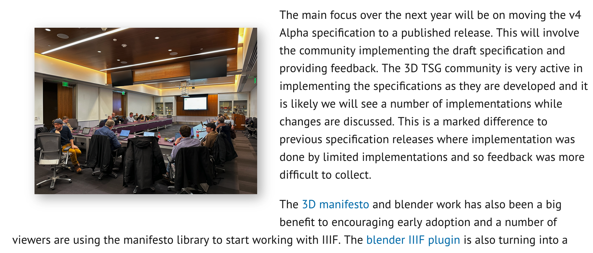
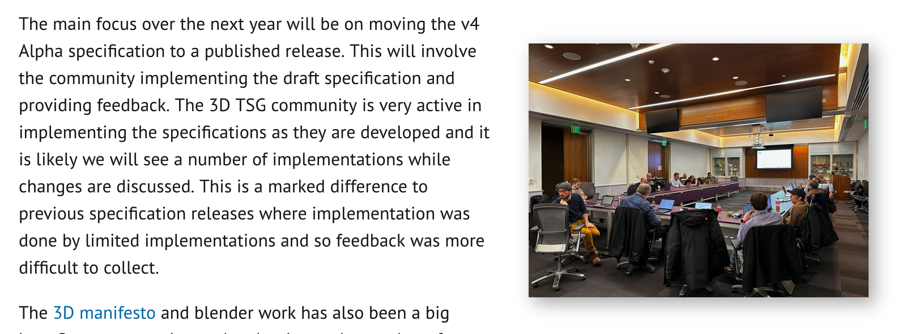

# Adding News Images

Step 1: Add image to the website

Add your image to source/assets/images/news. Name your image so that its easy to link to a article with at least a year prepending the filename. 

Step 2: Add image template

To simplify the process of adding News images I've created the following template:

```

```

The things to change to use a different image are:

 * `src`: the location of the images (note you don't need to have the source directory)
 * `alt`: the ALT text for the image. Note the website won't build if this is missing
 * `align`: Possible values include `left`, `right` or `center` (default if align missing). This will align the image around the text.

The value of algn left will look as follows with the text being shown around the image:

```

```

This will look as follows:



Align right:
```

```

This will look as follows:



If the align property is missing or empty then the image will default to the centre:

```
{% include content/image.html src="assets/images/news/2024-washington3d.png" alt="Image of 3d meeting in Washington" }
```

This will look as follows:


